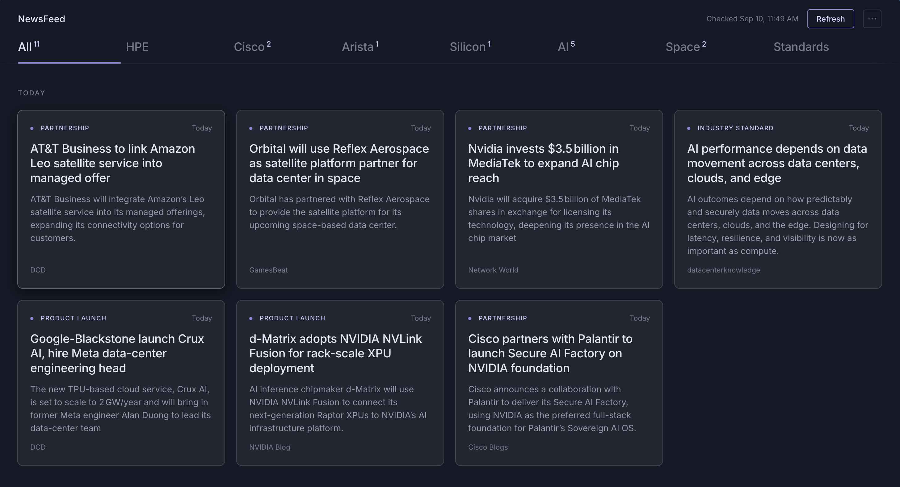

# NewsFeed

A daily brief on data center networking. Reads ~30 sources, picks the few
stories worth knowing, and writes a summary when you open one.

**[Live site](https://news-agg-v2.vercel.app/)**



Seven beats — HPE/Juniper, Cisco, Arista, merchant silicon, AI infrastructure,
orbital data centers, and networking standards (RoCE, Ultra Ethernet, IEEE,
OCP). Three or four stories each, sorted by publish date.

## How it works

RSS from trade press, vendor newsrooms and engineering blogs, plus a Google
News query per beat. Items matching that beat's keywords go to an LLM, which
picks the three or four most significant and tags each one. Summaries are
written on demand, the first time you open a story.

Dismissing a story records the source, tag and beat as a negative signal.
Submitting a URL the pipeline missed marks that source trusted, so future
items from it rank higher.

## Design notes

**Refresh runs one beat per request.** Vercel's Hobby tier kills a function at
60 seconds and Groq's free tier caps tokens per minute — seven beats in one
call fits neither. The client walks the beats with a cursor and shows progress.

**Dedupe happens before the LLM, not after.** Candidates are checked against
stored URLs first, so re-runs cost nothing in tokens. The stories table doubles
as the ledger, which is also why read stories are never deleted.

**Summaries are lazy.** Writing all 28 upfront would blow the daily token
budget on stories you'd never open. One call per story, on first click.

**Keywords are an OR gate, not a ranking signal.** A single match makes an item
a candidate, so the terms have to stay narrow — a broad word like `ethernet`
matches everything on its beat and stops filtering entirely. Ranking is the
LLM's job; keywords just cut the input down to something affordable.

## Stack

Vanilla JS frontend, no build step. Vercel serverless functions. Supabase for
storage. Groq for inference (`openai/gpt-oss-20b`).

Runs free on all three: Groq's free tier covers ~30 calls a day, Supabase's
500 MB holds years of stories at a couple of KB each, and the whole thing fits
in Hobby's function limits.

<details>
<summary><b>Running it yourself</b></summary>

**1.** Create a Supabase project and run `migration.sql` in the SQL Editor.

**2.** Get a free API key from [console.groq.com](https://console.groq.com).

**3.** Import the repo into Vercel and set:

| Variable | Where it comes from |
| --- | --- |
| `SUPABASE_URL` | Supabase → Project Settings → API |
| `SUPABASE_SERVICE_KEY` | same page, the `service_role` key |
| `GROQ_API_KEY` | console.groq.com |
| `LLM_MODEL` | `openai/gpt-oss-20b` |
| `REFRESH_SECRET` | any random string |

**4.** Fill in `SUPABASE_URL`, `SUPABASE_ANON_KEY` and `REFRESH_SECRET` at the
top of the script in `public/index.html`.

Deploy. The page refreshes itself on open if the last run was over 20 hours ago.

**Backfill** — a normal refresh looks back 5 days. To reach further:

```
/api/refresh?mode=backfill&cursor=6&secret=YOUR_SECRET
```

21-day window, up to 8 stories per beat. `cursor` is the beat index, 0–6.

**Adding a source** — feeds and keywords live in `api/_lib/sources.js`, one
array of each per beat.

```
api/
  refresh.js      fetch, filter, select
  summarize.js    on-demand summaries
  submit.js       manual story submission
  feedback.js     records dismissals
  _lib/
    sources.js    feeds and keywords per beat
    util.js       Groq client, RSS parsing, helpers
public/
  index.html      the whole frontend
migration.sql     schema
vercel.json       cron + routing
```

</details>
